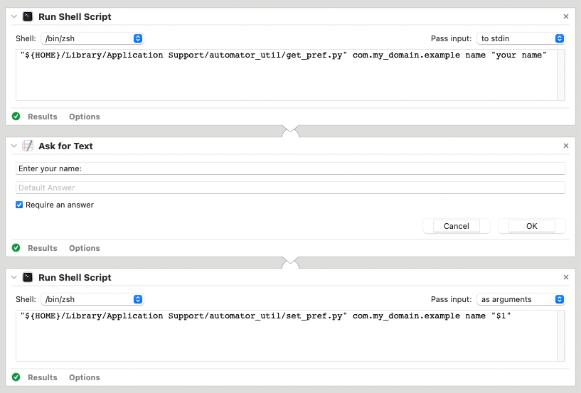

# automator_util

Some scripts to help manage externalities with Apple Automator apps and workflows.

## Overview

These scripts were written to support Automator apps and workflows in two ways:

* They provide a means of saving state in a preferences file between runs.
* They make it easier to locate external resources your workflow may draw on.

The `install.py` script manages a directory within `~/Library/Application Support`. You can enter `path/to/install.py -h` for usage notes.

The directory tree would generally look something like this:

    ~/Library/Application Support/automator_util/
      ↪︎ load_prefs.py
      ↪︎ save_prefs.py
      ↪︎ proj/
        ↪︎ my_external_project/
          ↪︎ my_external_script

Here, `load_prefs.py`, `save_prefs.py`, and `my_external_project/` would typically be symlinks, though you can make local copies instead using `install.py -c`.

The idea here is that by having a standardized location for everything your workflow needs to access externally, you don't have to make assumptions about where things are.

## Requirements

Clearly, this project is meant for macOS, as it is all about Apple's Automator
app.

But more importantly, this implementation is also dependent on having **Python 3.7** or later installed.

Though macOS does not ship with Python 3 preinstalled, it is included in the Command Line Developer Tools, and you can enter `python3 --version` to prompt you to install these if necessary. The version that actually gets installed is not typically the latest and greatest, but automator_util's requirements have been kept modest enough that it should suffice.

There are no script dependencies beyond the Python standard library.

(You can get a more up-to-date version using a package manager such as [Homebrew](https://brew.sh/) or by simply running a [stand-alone installer](https://www.python.org/downloads/).)

## Managing Workflow Preferences

Before you begin, be sure to have run the `install.py` script.

Now consider the following workflow:

We begin with a Run Shell Script action that needs no input and, in turn, executes the `get_pref.py` script:

    "${HOME}/Library/Application Support/automator_util/get_pref.py" com.my_domain.example name "your name"

`get_pref.py` is supplied 3 args:

1. `com.my_domain.example`: This is the name of your preferences file.
2. `name`: This is the key to look up within the file (i.e. the string `"name"`).
3. `"your name"`: This is the default value to use in case the look-up fails.

By convention, preferences file names in macOS should begin with a domain name you manage in reverse order to prevent naming collisions between different apps. `get_pref.py` and `set_pref.py` will automatically append a `.json` file extension if needed. So the path to your preferences file should wind up being:

    ${HOME}/Library/Preferences/com.my_domain.example.json

The next action is an Ask for Text requesting that the user enter their name. The default name should read `your name` the first time the workflow is run.

The last action is another Run Shell Script. This time, it executes `set_pref.py` instead:

    "${HOME}/Library/Application Support/automator_util/set_pref.py" com.my_domain.example name "$1"

Again, the first 2 args are the preferences file name and the preference key. The last is the value to set for that key, which is taken as input from the previous action's output. Note that **Pass input: as arguments** was selected so that the value would get assigned to `$1`.

If the user were to enter `John Doe` as his name, the preferences file should now contain:

    {
        "name": "John Doe"
    }

The next time the workflow is run, `John Doe` should appear as the default name in the second action's dialog window, rather than `no name`.

## Running an External Script

Let's say you had a script you want to run from your workflow at:

    ~/my_external_project/my_external_script

You could run:

    ./install.py ~/my_external_project

This would place a symlink to your project directory at:

    ~/Library/Application Support/automator_util/proj/my_external_project

Then you could add a Run Shell Script action to your workflow which executes your script with:

    "${HOME}/Library/Application Support/automator_util/proj/my_external_project/my_external_script

If you ran `./install.py -c ~/my_external_project` instead, it would copy your entire project into the `proj` directory rather than making a symlink. In this case, you will need to remember to run the command again every time you change your script. But it might be a good idea to do this for the end user, since there will be less risk of breaking the link should they move the folder around. (Note that if, as in this case, the external path is also within the home directory, a relative path will be used for the symlink.)